# re-won-launcher-1792

This is a source-level reconstruction of the **WON-era Half-Life launcher**, build **1792** compiled *Sep 20 2001*, protocol version **1.1.0.8**. This project aims to recereate the original launcher sources for archival & historical reasons and aims to bring various improvements and bug fixes over the original version of the launcher.

<p align="center">
  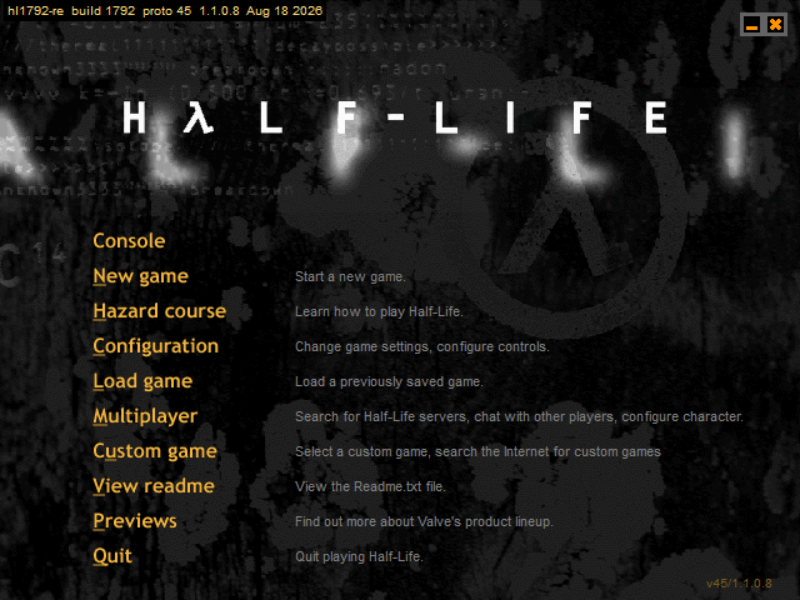
</p>

<table align="center" width="640">
<tr>
<td align="center"><a href="images/gallery/controls.png">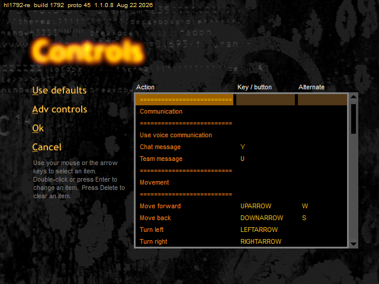</a><br><sub>Controls</sub></td>
<td align="center"><a href="images/gallery/advanced_controls.png">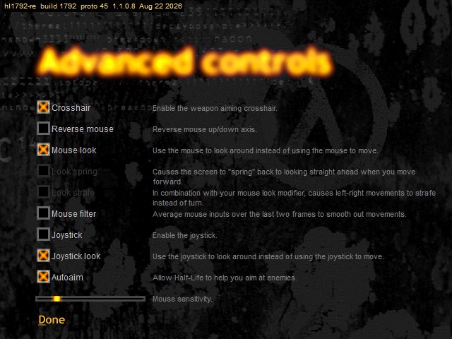</a><br><sub>Advanced controls</sub></td>
<td align="center"><a href="images/gallery/video_options.png">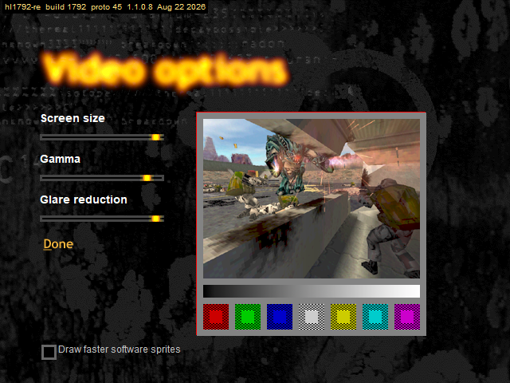</a><br><sub>Video options</sub></td>
<td align="center"><a href="images/gallery/video_modes.png">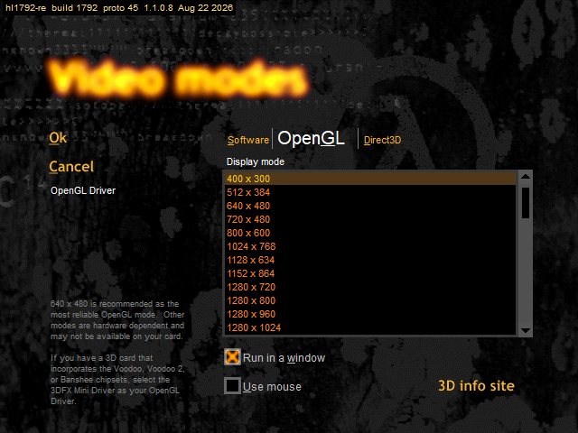</a><br><sub>Video modes</sub></td>
</tr>
<tr>
<td align="center"><a href="images/gallery/customize.png">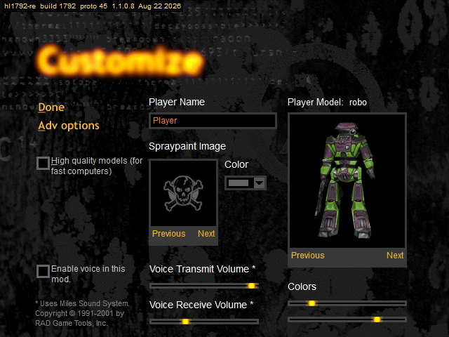</a><br><sub>Customize</sub></td>
<td align="center"><a href="images/gallery/internet_games.png">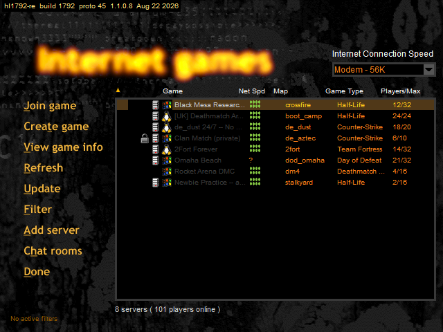</a><br><sub>Internet games</sub></td>
<td align="center"><a href="images/gallery/game_info.png">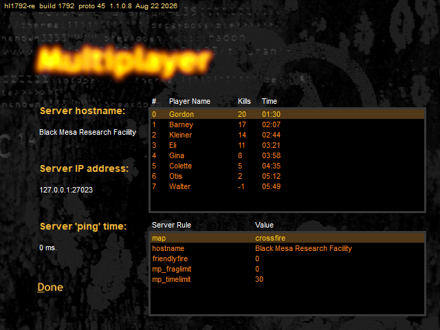</a><br><sub>Game info</sub></td>
<td align="center"><a href="images/gallery/filter_servers.png">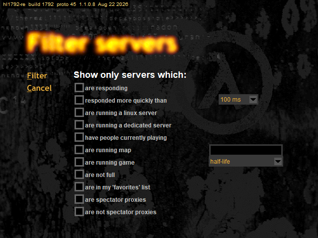</a><br><sub>Filter servers</sub></td>
</tr>
<tr>
<td align="center"><a href="images/gallery/chat_rooms.png">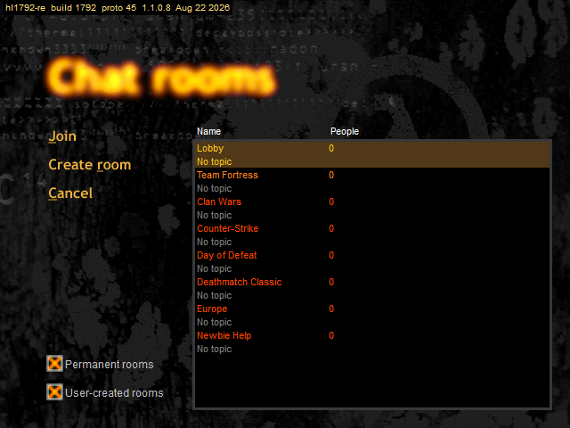</a><br><sub>Chat rooms</sub></td>
<td align="center"><a href="images/gallery/create_game.png">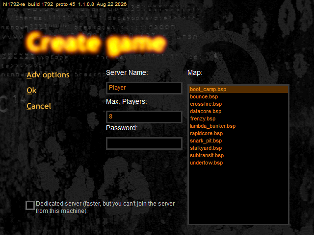</a><br><sub>Create game</sub></td>
<td align="center"><a href="images/gallery/create_game_advanced.png">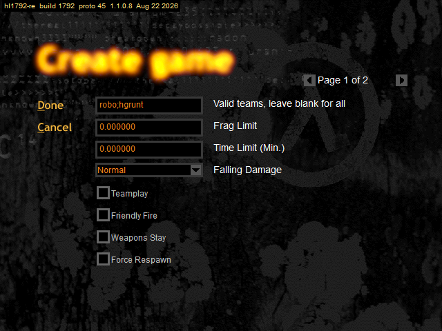</a><br><sub>Advanced options</sub></td>
<td align="center"><a href="images/gallery/custom_game.png">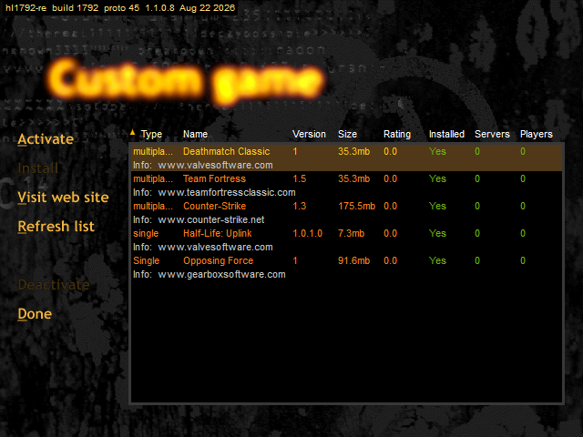</a><br><sub>Custom game</sub></td>
</tr>
</table>

This project has been reversed **95% by using LLMs and agent orchestration in a matter of 2 months**. By utilizing advanced agent orchestration techniques and custom-crafted prompts, it was possible to reconstruct the imaginatory style of the code the original launcher might've once had by an acceptable margin. While I personally love reversing, the introduction of LLMs and agentic workflows has helped me to create projects like this one, because the agents significantly speedup the process of reversing I would need do by hand, painfuly slowly.

While there's no build of the launcher with debug symbols we know of, there are various sources from where we can gather extra information about the code:

- RTTI for class names.
- NetGame.exe launcher for a bunch of file names.
- The fact that the linker puts source files in chronological order sorted alphabetically into the binary helps us to deduce file names more accurately.
- Quake sources, since this code has a bunch of overlap.

Using a combination of such sources we are able to guess how did the original code look like, with some accuracy.

## Fixes

This is a list of fixes this project implements:

- **More video modes resolutions**: The video modes dialog now have more resolutions available.
- **Window title bar**: In Windowed mode, the launcher is now a full-fledged window with a title bar and no new windows when selecting sub menus.
- **Working fullscreen**: In Fullscreen mode the launcher fills the screen again instead of sitting in a small window in the corner.
- **Prompts open on the launcher**: Message boxes and prompts are centred on the launcher window instead of in the middle of the screen.
- **Remembered window position**: In Windowed mode the launcher reopens where you last dragged it.
- **Mouse wheel scrolling**: The wheel now scrolls whatever list, drop-down or scrollbar the pointer is over.
- **Keyboard list navigation**: The arrow keys, Page Up/Down, Home and End move the selection in a list, and Enter opens it.

## WON Server Emulation

WON's original master, auth and chat servers have been offline for years, so a
stock launcher can't authenticate, browse the server list, or join chat rooms.
This project ships `wonserverd`, a local emulator of those services, so the
launcher works the way it did in 2001. It builds alongside the launcher — see
[`wonserver/README.md`](wonserver/README.md) for the full setup, including a
standalone build and every supported command-line flag.

Quick start:

1. Build the project (see below); `wonserverd.exe` builds along with `hl.exe`.
2. Run `wonserverd.exe` once from the folder you want it to keep its keys in.
   It generates `verifier.key`, `auth.key` and `kver.kp` on first start (this
   can take about a minute).
3. Copy the generated `kver.kp` into your Half-Life folder, replacing the
   original — the launcher uses it to trust the emulator's certificates.
4. Point every block in the Half-Life folder's `woncomm.lst` at
   `127.0.0.1` (Titan/Auth on port `6002`, Master on `27010`, ModServer on
   `27011`).
5. Keep `wonserverd.exe` running, then launch `hl.exe` as normal.

## Building

### Prerequisites

- **Visual Studio 2026** (toolset **v145**) with the following components:
  - *Desktop development with C++*
  - *C++ MFC for v145 build tools (x86 & x64)*
  - *C++ MFC for v145 build tools with Spectre mitigations* is **not** required,
    but the **MBCS** MFC libraries **are** — install
    *C++ MFC for ... (MBCS)* (the launcher is a MultiByte, not Unicode, MFC app).
  - A Windows 10/11 SDK (provides `winmm.lib`, `ddraw.lib`, `dxguid.lib`).
- **CMake ≥ 3.25**.
- **Win32 (x86)** — the entire reconstruction is 32-bit.

### Setup

```sh
cmake -S . -B build -G "Visual Studio 18 2026" -A Win32
cmake --build build --config Debug
```

If your CMake doesn't yet know the 2026 generator, use the 2022 generator with
the v145 toolset:

```sh
cmake -S . -B build -G "Visual Studio 17 2022" -A Win32 -T v145
cmake --build build --config Debug
```

Open `build/re-won-launcher-1792.sln` to develop in the IDE; `hl` is set as the
startup project.

### Deploying to a game folder

Copy `halflife_path.txt.example` to `halflife_path.txt` and point it at your
WON-era Half-Life install. After that, every build copies `hl.exe` (and the WON
DLLs) into that folder automatically, and F5 in Visual Studio launches the
deployed copy directly. Skip this file and the build still works — it just
leaves the binaries in `build/<config>/` for you to copy manually.